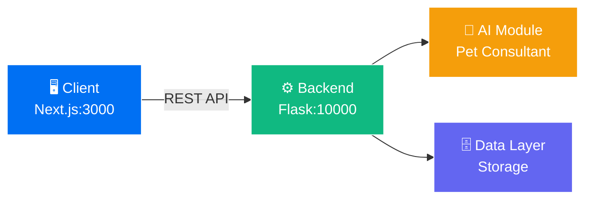

<div align="center">

# 🐾 5Pets Development Guide

### *Your Complete Pet Care Platform - Local Development Setup*

[](https://nextjs.org/)
[](https://flask.palletsprojects.com/)
[](LICENSE)

[Features](#-key-features) • [Quick Start](#-quick-start) • [Architecture](#-architecture) • [Documentation](#-detailed-setup)

---

</div>

## 🌟 Key Features

<table>
<tr>
<td width="33%" align="center">

### 🎨 Modern Frontend
Next.js-powered responsive UI with seamless UX

</td>
<td width="33%" align="center">

### ⚡ Robust Backend
Flask API with efficient data processing

</td>
<td width="33%" align="center">

### 🤖 AI Integration
Intelligent pet consultation chatbot

</td>
</tr>
</table>

---

## 🚀 Quick Start

```bash
# Clone the repository
git clone <repository-url>
cd 5pets

# Backend Setup
cd src/server
python -m venv .env.bin
source .env.bin/bin/activate  # Windows: .env.bin\Scripts\activate
pip install -r requirements.txt
python app.py

# Frontend Setup (in new terminal)
cd src/client
npm install
echo "NEXT_PUBLIC_API_URL=http://localhost:10000/api" > .env
npm run dev
```

**🎉 Done!** Visit [http://localhost:3000](http://localhost:3000)

---

## 📐 Architecture



### 📁 Project Structure

```
5pets/
┣━━ 📂 data/                    Raw datasets and crawled data
┣━━ 🎨 design/                  UI/UX mockups and assets
┣━━ 📋 pa/                      Project proposals and architecture docs
┣━━ 📚 docs/                    API specifications and manuals
┃
┗━━ 💻 src/                     Core application source
    ┣━━ ⚛️ client/              Next.js frontend application
    ┣━━ 🐍 server/              Flask backend API service
    ┗━━ 🤖 ai_pet_consultant/   AI chatbot logic module
```

---

## 🛠️ Prerequisites

Ensure your development environment has the following installed:

| Technology | Version | Download |
|:-----------|:--------|:---------|
| **Node.js** | ≥ 18.x | [nodejs.org](https://nodejs.org/) |
| **Python** | ≥ 3.10 | [python.org](https://python.org/) |
| **Git** | Latest | [git-scm.com](https://git-scm.com/) |

**Quick Check:**
```bash
node --version && python --version && git --version
```

---

## 📘 Detailed Setup

### 🖥️ Frontend Configuration

<details>
<summary><b>📍 Location:</b> <code>src/client</code></summary>

#### Step 1: Environment Variables

Create `.env` file:

```env
# Backend API Endpoint
NEXT_PUBLIC_API_URL=http://localhost:10000/api

# Optional: Other configurations
# NEXT_PUBLIC_ANALYTICS_ID=your_analytics_id
```

#### Step 2: Install Dependencies

```bash
cd src/client
npm install
```

#### Step 3: Development Server

```bash
npm run dev
```

> ✅ **Frontend running at:** [http://localhost:3000](http://localhost:3000)

#### Available Scripts

| Command | Description |
|:--------|:------------|
| `npm run dev` | Start development server with hot reload |
| `npm run build` | Create production build |
| `npm start` | Run production server |
| `npm run lint` | Check code quality |

</details>

---

### ⚙️ Backend Configuration

<details>
<summary><b>📍 Location:</b> <code>src/server</code></summary>

#### Step 1: Virtual Environment

```bash
cd src/server

# Create virtual environment
python -m venv .env.bin

# Activate it
source .env.bin/bin/activate  # macOS/Linux
# OR
.env.bin\Scripts\activate     # Windows
```

#### Step 2: Install Dependencies

```bash
pip install -r requirements.txt
```

#### Step 3: Start Flask Server

```bash
python app.py
```

> ✅ **Backend API running at:** [http://localhost:10000](http://localhost:10000)

#### Environment Variables (Optional)

Create `.env` file in `src/server`:

```env
FLASK_ENV=development
FLASK_DEBUG=True
SECRET_KEY=your_secret_key_here
DATABASE_URL=your_database_connection
```

</details>

---

### 🤖 AI Module Setup

<details>
<summary><b>📍 Location:</b> <code>src/ai_pet_consultant</code></summary>

This module powers the intelligent pet consultation features.

#### Installation

```bash
cd src/ai_pet_consultant

# Create isolated environment (recommended)
python -m venv venv
source venv/bin/activate  # Windows: venv\Scripts\activate

# Install AI dependencies
pip install -r requirements.txt
```

#### Configuration

Configure AI model settings in `config.py` or via environment variables.

</details>

---

## 🎯 Running Complete Stack

### Option 1: Multi-Terminal Approach

**Terminal 1 - Backend:**
```bash
cd src/server
source .env.bin/bin/activate
python app.py
```

**Terminal 2 - Frontend:**
```bash
cd src/client
npm run dev
```

### Option 2: Using Process Manager (Recommended)

Install `concurrently`:
```bash
npm install -g concurrently
```

Run from project root:
```bash
concurrently "cd src/server && python app.py" "cd src/client && npm run dev"
```

---

## 🔧 Troubleshooting

### 🚨 Common Issues

<details>
<summary><b>Port Already in Use</b></summary>

**Frontend (Port 3000):**
```bash
# Find process
lsof -ti:3000  # macOS/Linux
netstat -ano | findstr :3000  # Windows

# Kill process or change port in package.json
```

**Backend (Port 10000):**
```bash
# Change port in app.py
app.run(port=10001)  # Use different port

# Update frontend .env
NEXT_PUBLIC_API_URL=http://localhost:10001/api
```

</details>

<details>
<summary><b>CORS Errors</b></summary>

Ensure `flask-cors` is configured in `app.py`:

```python
from flask_cors import CORS

app = Flask(__name__)
CORS(app, origins=["http://localhost:3000"])
```

</details>

<details>
<summary><b>Module Not Found Errors</b></summary>

```bash
# Verify virtual environment is activated
which python  # Should show venv path

# Reinstall dependencies
pip install -r requirements.txt --force-reinstall
```

</details>

<details>
<summary><b>Environment Variables Not Loading</b></summary>

- Restart the development server after changing `.env`
- Check file name is exactly `.env` (not `.env.txt`)
- Ensure no spaces around `=` in variable assignments

</details>

---

## 📚 Additional Resources

- 📖 [API Documentation](docs/API.md)
- 🎨 [Design System](design/STYLE_GUIDE.md)
- 🏗️ [Architecture Details](pa/ARCHITECTURE.md)
- 🐛 [Bug Reports](https://github.com/your-repo/issues)

---

## 🤝 Contributing

We welcome contributions! Please see our [Contributing Guidelines](CONTRIBUTING.md) for details.

---

## 📄 License

This project is licensed under the MIT License - see the [LICENSE](LICENSE) file for details.

---

<div align="center">

### 💝 Built with Love by the 5Pets Team

**Questions?** Open an issue or contact us at [team@5pets.dev](mailto:team@5pets.dev)

[⬆️ Back to Top](#-5pets-development-guide)

</div>